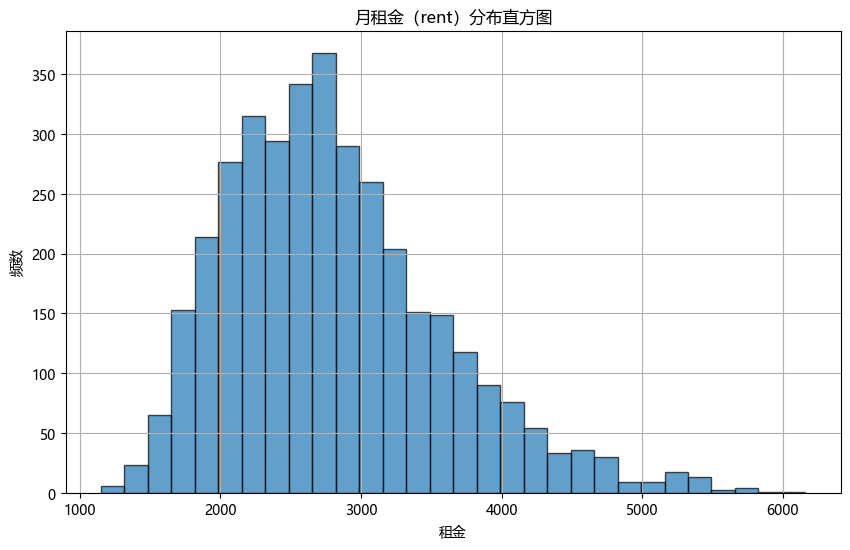
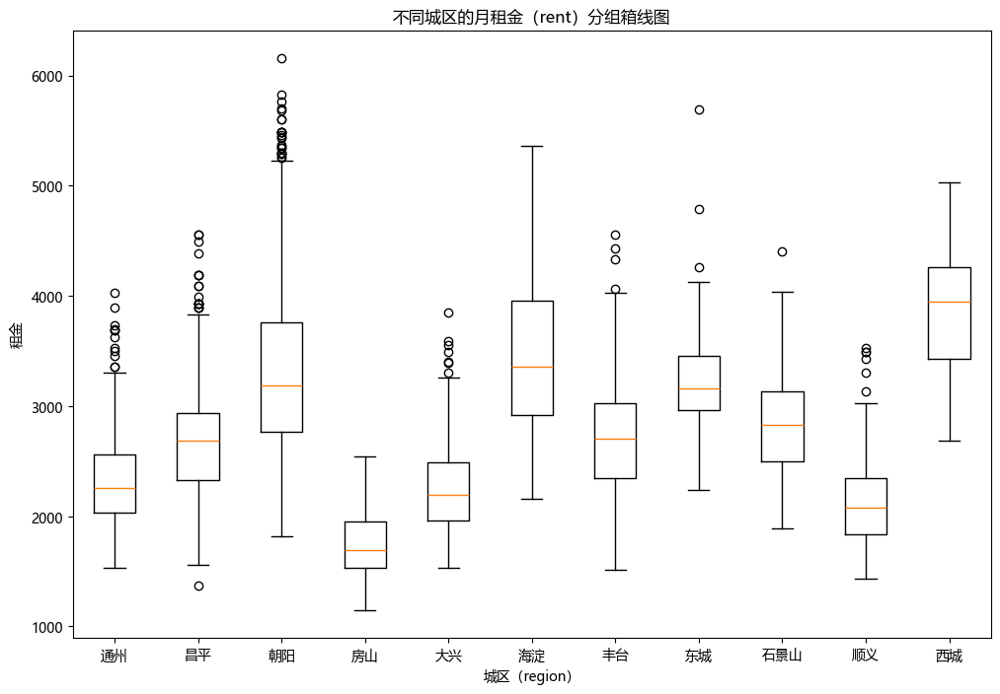
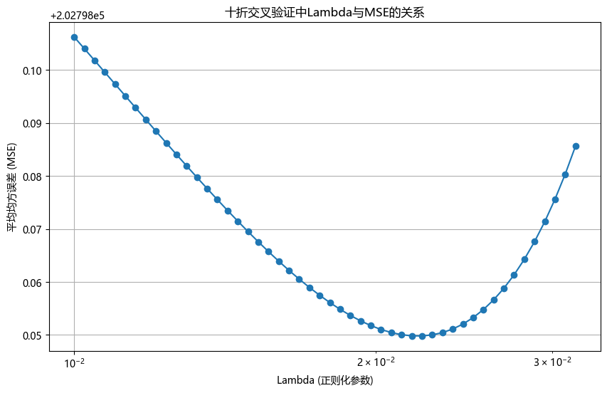

@import "../style.less"

# 第二次作业解答

## 1. 证明题

> (1) 
> 
> Given conditions:
> 
>> (A1) The relationship between response (y) and covariates (X) is linear;
>> 
>> (A2) $\mathbf{X}$ is a non-stochastic matrix and rank($\mathbf{X}$) = $p$;
>> 
>> (A3) $E(\varepsilon) = 0$. This implies $E(y) = \mathbf{X} \beta$;
>> 
>> (A4) $\mathrm{cov}(\varepsilon) = E(\varepsilon \varepsilon^\mathrm{T}) = \sigma^2 \boldsymbol{I}_N$; (Homoscedasticity);
>> 
>> (A5) $\varepsilon$ follows multivariate normal distribution $N(0, \sigma^2 \boldsymbol{I}_N)$ (Normality).
> 
> Prove the following results:
> 
>> (1.1) Prove that the OLS estimator $\hat{\beta}$ is the same as the maximum likelihood estimator.
>> 
>> (1.2) Prove
>> $$
>> \hat{\beta} \sim N(\beta, \sigma^2 (X^\top X)^{-1})
>> $$
>> $$
>> (N - p)\hat{\sigma}^2 \sim \sigma^2 \chi^2_{N - p}
>> $$

### (1.1)
We know that $\hat{\beta}_{\mathrm{OLS}}=\left( \mathbf{X}^{\mathrm{T}}\mathbf{X} \right) ^{-1}\mathbf{X}^{\mathrm{T}}\mathbf{y}$, and according to $\varepsilon\sim N(0, \sigma^2 \boldsymbol{I}_N)$ we have
$$
\mathbf{y}\sim N\left( \mathbf{X}\beta ,\sigma ^2\boldsymbol{I} \right) .
$$

As a result the joint-PDF of $\mathbf{y}$ is 
$$
f\left( Y|\beta \right) =\frac{1}{\left( 2\pi \sigma ^2 \right) ^{N/2}}\exp \left( -\frac{1}{2\sigma ^2}\left( \mathbf{X}\beta -\varepsilon \right) ^{\mathrm{T}}\left( \mathbf{X}\beta -\varepsilon \right) \right) .
$$

Let
$$
L\left( \beta \right) =-\log f\left( Y|\beta \right) =\frac{N}{2}\log 2\pi \sigma ^2+\frac{1}{2\sigma ^2}\left( \mathbf{X}\beta -\varepsilon \right) ^{\mathrm{T}}\left( \mathbf{X}\beta -\varepsilon \right) ,
$$
and what we what to prove if $\hat{\beta}_{\mathrm{OLS}}=\mathop {\mathrm{arg}\min} \limits_{\beta}L\left( \beta \right)$, so
$$
\frac{\mathrm{d}}{\mathrm{d}\beta}L\left( \beta \right) =-2\mathbf{y}^{\mathrm{T}}\mathbf{X}-2\mathbf{X}^{\mathrm{T}}\mathbf{X}\beta \quad \Longrightarrow \quad \left. \frac{\mathrm{d}}{\mathrm{d}\beta}L\left( \beta \right) \right|_{\beta =\hat{\beta}_{\mathrm{OLS}}}=0.
$$

### (1.2)
We express $\hat{\beta}$ with subsitituting $\mathbf{y}=\mathbf{X}\beta +\varepsilon$,
$$
\hat{\beta}=\left( \mathbf{X}^{\mathrm{T}}\mathbf{X} \right) ^{-1}\mathbf{X}^{\mathrm{T}}\left( \mathbf{X}\beta +\varepsilon \right) =\left( \mathbf{X}^{\mathrm{T}}\mathbf{X} \right) ^{-1}\mathbf{X}^{\mathrm{T}}\mathbf{X}\beta +\left( \mathbf{X}^{\mathrm{T}}\mathbf{X} \right) ^{-1}\mathbf{X}^{\mathrm{T}}\varepsilon =\beta +\left( \mathbf{X}^{\mathrm{T}}\mathbf{X} \right) ^{-1}\mathbf{X}^{\mathrm{T}}\varepsilon .
$$

So
$$
E\left( \hat{\beta} \right) =\beta +\left( \mathbf{X}^{\mathrm{T}}\mathbf{X} \right) ^{-1}\mathbf{X}^{\mathrm{T}}E\left( \varepsilon \right) =\beta ,
$$
$$
D\left( \hat{\beta} \right) =\left( \mathbf{X}^{\mathrm{T}}\mathbf{X} \right) ^{-1}\mathbf{X}^{\mathrm{T}}D\left( \varepsilon \right) \left( \left( \mathbf{X}^{\mathrm{T}}\mathbf{X} \right) ^{-1}\mathbf{X}^{\mathrm{T}} \right) ^{\mathrm{T}}=\left( \mathbf{X}^{\mathrm{T}}\mathbf{X} \right) ^{-1}\mathbf{X}^{\mathrm{T}}\sigma ^2\boldsymbol{I}\mathbf{X}\left( \mathbf{X}^{\mathrm{T}}\mathbf{X} \right) ^{-1}=\sigma ^2\left( \mathbf{X}^{\mathrm{T}}\mathbf{X} \right) ^{-1}.
$$

Finally $\hat{\beta} \sim N(\beta, \sigma^2 (X^\top X)^{-1})$. Cus we use $p$ degree of freedom in estimate $
\hat{\beta}$ so if we want to estimate $\hat{\sigma}^2$ we should devide $N-p$ instead of $N$,
$$
\hat{\sigma}^2=\frac{1}{N-p}\left( \mathbf{y}-\mathbf{X}\hat{\beta} \right) ^{\mathrm{T}}\left( \mathbf{y}-\mathbf{X}\hat{\beta} \right) =\frac{1}{N-p}\mathbf{e}^{\mathrm{T}}\mathbf{e}.
$$

Risidual vector $\mathbf{e}$ has the following property.
$$
\mathbf{e}:= \mathbf{y}-\mathbf{X}\hat{\beta}=\mathbf{y}-\mathbf{X}\left( \mathbf{X}^{\mathrm{T}}\mathbf{X} \right) ^{-1}\mathbf{X}^{\mathrm{T}}\mathbf{y}=\left( \mathbf{I}_N-\mathbf{P} \right) \mathbf{y}=\left( \mathbf{I}_N-\mathbf{P} \right) \varepsilon .
$$
Here $\mathbf{P}=\mathbf{X}\left( \mathbf{X}^{\mathrm{T}}\mathbf{X} \right) ^{-1}\mathbf{X}^T$ is a projection matrix, as as $\mathbf{I}_N-\mathbf{P}$. And
$$
\begin{align*}
\left( \mathbf{I}_N-\mathbf{P} \right) \mathbf{y}&=\left( \mathbf{I}_N-\mathbf{P} \right) \left( \mathbf{X}\beta +\varepsilon \right) =\left( \mathbf{I}_N-\mathbf{P} \right) \mathbf{X}\beta +\left( \mathbf{I}_N-\mathbf{P} \right) \varepsilon 
\\
&=X\beta -\mathbf{X}\left( \mathbf{X}^{\mathrm{T}}\mathbf{X} \right) ^{-1}\mathbf{X}^T\mathbf{X}\beta +\left( \mathbf{I}_N-\mathbf{P} \right) \varepsilon =\left( \mathbf{I}_N-\mathbf{P} \right) \varepsilon .
\end{align*}
$$
So 
$$
\hat{\sigma}^2=\frac{1}{N-p}\varepsilon ^T\left( \mathbf{I}_N-\mathbf{P} \right) \varepsilon.
$$

With $\mathrm{rank}\left( \mathbf{X} \right) =p$ we have $\mathrm{rank}\left( \mathbf{I}_N-\mathbf{P} \right) =N-p$. so
$$
\hat{\sigma}^2\sim \frac{\sigma ^2}{N-p}\chi _{N-p}^{2}.
$$

> (2) 
> Suppose $ y $ follows the log-linear regression relationship with non-stochastic $ x \in \mathbb{R}^p $, i.e.,
> $$\log(y) = x^\top \beta + \epsilon,$$
> where $ \epsilon $ follows normal distribution $ N(0, \sigma^2) $. Please calculate $ E(y) $.

Transform the expression for $y$,
$$
y=\exp \left( x^{\mathrm{T}}\beta +\epsilon \right) .
$$
So
$$
E\left( y \right) =E\left( \exp \left( x^{\mathrm{T}}\beta +\epsilon \right) \right) =\exp \left( x^{\mathrm{T}}\beta \right) E\left( \exp \epsilon \right) .
$$

To calculate $E\left( \exp \epsilon \right)$, 
$$
\begin{align*}
E\left( \exp \epsilon \right) &=\int_{\mathbb{R}}{\exp \epsilon \frac{1}{\sqrt{2\pi \sigma ^2}}\exp \left( -\epsilon ^2/2\sigma ^2 \right)}\frac{\mathrm{d}\varepsilon}{\mathrm{d}\exp \epsilon}\mathrm{d}\exp \epsilon 
\\
&=\exp \left( \sigma ^2/2 \right) \int_{\mathbb{R}}{\frac{1}{\sqrt{2\pi \sigma ^2}}\exp \left( -\left( \epsilon -\sigma ^2 \right) ^2/2\sigma ^2 \right)}\mathrm{d}\varepsilon =\exp \left( \sigma ^2/2 \right) 
\end{align*}
$$
As a result $E\left( y \right) =E\left( \exp \left( x^{\mathrm{T}}\beta +\epsilon \right) \right) =\exp \left( x^{\mathrm{T}}\beta +\frac{\sigma ^2}{2} \right) $.


> (3)
> Let $ y_i $ be the dependent variable, $ \boldsymbol{x}_i $ be the vector of independent variables including an intercept term, and $ \hat{\beta} $ be the vector of regression coefficients estimated by OLS. Define $\hat{y}_i=\boldsymbol{x}_{i}^{\mathrm{T}}\hat{\beta}$. Define the total sum of squares (TSS), explained sum of squares (ESS), and residual sum of squares (RSS) as follows
> $$TSS = \sum_i (y_i - \bar{y})^2, \quad ESS = \sum_i (\hat{y}_i - \bar{y})^2, \quad RSS = \sum_i (y_i - \hat{y}_i)^2.$$
> Please prove: $ TSS = ESS + RSS $.

Insert $\hat{y}_i$ between the left hand side,
$$
\mathrm{TSS}=\sum_i{\left( y_i-\bar{y} \right) ^2}=\sum_i{\left[ \left( y_i-\hat{y}_i \right) +\left( \hat{y}_i-\bar{y} \right) \right] ^2=\mathrm{RSS}+\mathrm{ESS}+2\sum_i{\left( y_i-\hat{y}_i \right)}}\left( \hat{y}_i-\bar{y} \right),
$$
so we need to prove
$$
\sum_i{\left( y_i-\hat{y}_i \right) \left( \hat{y}_i-\bar{y} \right)}=0.
$$

First,
$$
\sum_i{\left( y_i-\hat{y}_i \right)}\bar{y}=\bar{y}\sum_i{e_i=0}.
$$

And we only need to prove
$$
\sum_i{\left( y_i-\hat{y}_i \right) \hat{y}_i}=\mathbf{e}^{\mathrm{T}}\hat{y}=0.
$$
And 
$$
\mathbf{e}^{\mathrm{T}}\hat{y}=\mathbf{e}^{\mathrm{T}}\mathbf{X}\hat{\beta}=\left( \mathbf{I}-\mathbf{X}\left( \mathbf{X}^{\mathrm{T}}\mathbf{X} \right) ^{-1}\mathbf{X}^{\mathrm{T}} \right) ^{\mathrm{T}}\mathbf{X}\hat{\beta}=0\hat{\beta}=0.
$$

Q.E.D.


## 2. 岭回归分析
> 在实际问题中，我们常常会遇到样本容量相对较小，而特征很多的场景. 在这种情况下如果直接求解线性回归模型，较小的样本无法支持带有很多模型参数、且有多个模型能够“完全”拟合训练集中的所有数据点. 此外，模型很容易出现过拟合. 为缓解这些问题，常在线性回归的损失函数中引入正则化项 $ p(\beta) $，通常形式如下：
> $$\hat{\beta} = \arg \min_{\beta} \left\{ \sum_{i=1}^{N} \left( y_i - \sum_{j} x_{ij} \beta_j \right)^2 + \lambda p(\beta) \right\}$$
> 其中，$ \lambda > 0 $ 为正则化参数. 正则化表示对模型的一种偏好，例如 $ p(\beta) $ 一般取模型的复杂度进行约束，它在保持良好预测性能的同时，倾向于选择较为简单的模型，从而帮助防止过拟合并提高模型的泛化能力. 考虑岭回归（ridge regression）问题，即设置公式（4）中正则项 $ p(\beta) = \sum_j \beta_j^2 $. 本题将针对该回归问题的显式解以及正则化的影响进行探讨.
>
> (1) 请证明岭回归的最优解 $ \hat{\beta}^{\text{ridge}} $ 的显式解表达式具有以下两种等价形式：
> $$\hat{\beta}^{\text{ridge}} = \left( X^\top X + \lambda I_p \right)^{-1} X^\top y = X^\top \left( X X^\top + \lambda I_N \right)^{-1} y.$$
> 请分析以上两种最优解分别在何种情况下计算速度更快？
>
> (2) 分析岭回归的最优解 $ \hat{\beta}^{\text{ridge}} $ 和最小二乘估计 $ \hat{\beta}^{\text{LS}} $ 的区别？
>
> (3) 针对实际中描述的上述残差现象，完成以下任务:
> 
> (3.1) 完成数据读入与汇总统计，绘制训练集数据中月租金（rent）的直方图，观察月租金的大致分布，并进行简要解读；绘制训练集数据中月租金（rent）-城区（region）分组箱线图，分析不同城区的房价差异，并给出简要解读.
> 
> (3.2) 利用训练集建立以月租金（rent）为因变量，去除人为变量的线性回归模型，编程实现最小二乘估计（不调用回归分析的包），写出拟合得到的模型并计算训练集上的均方误差（Mean Square Error, MSE）.
>
> (3.3) 编程实现岭回归的回归计（不调用回归分析的包），在训练集上使用十折交叉验证，画出验证集上平均均方误差（Mean Square Error, MSE）与 $ \lambda $ 的折线图，选出合适的 $ \lambda $.
>
> (3.4) 用选出的 $ \lambda $ 在训练集拟合最终模型，写出拟合得到的模型并计算测试集上的均方误差.


### (1)
关于 $\beta$ 的损失函数为
$$
\begin{align*}
L\left( \beta \right) &=\sum_i{\left( y_i-\sum_j{x_{ij}\beta _j} \right) ^2+\lambda \sum_j{\beta _{j}^{2}}}
\\
&=\left( \mathbf{y}-\mathbf{X}\beta \right) ^{\mathrm{T}}\left( \mathbf{y}-\mathbf{X}\beta \right) +\lambda \beta ^{\mathrm{T}}\beta .
\end{align*}
$$

于是就有
$$
\frac{\mathrm{d}L\left( \beta \right)}{\mathrm{d}\beta}=-2\mathbf{X}^{\mathrm{T}}\left( \mathbf{y}-\mathbf{X}\beta \right) +2\lambda \beta \triangleq 0.
$$

所以 $\beta =\left( \mathbf{X}^{\mathrm{T}}\mathbf{X}+\lambda \mathbf{I}_p \right) ^{-1}\mathbf{X}^{\mathrm{T}}\mathbf{y}.$ 下面证明另一个显式解是这个解的恒等变形, 利用 Sherman-Morrison-Woodbury 公式得到
$$
\left( \mathbf{X}^{\mathrm{T}}\mathbf{X}+\lambda \mathbf{I}_p \right) ^{-1}=\lambda ^{-1}\mathbf{I}_p-\lambda ^{-1}\mathbf{X}^{\mathrm{T}}\left( \lambda \mathbf{I}_N+\mathbf{XX}^{\mathrm{T}} \right) ^{-1}\mathbf{X}.
$$

所以由于 $\left( \mathbf{X}^{\mathrm{T}}\mathbf{X}+\lambda \mathbf{I}_p \right) ^{-1}\mathbf{X}^{\mathrm{T}}\mathbf{y}=\left( \lambda ^{-1}\mathbf{I}_p-\lambda ^{-1}\mathbf{X}^{\mathrm{T}}\left( \lambda \mathbf{I}_N+\mathbf{XX}^{\mathrm{T}} \right) ^{-1}\mathbf{X} \right) \mathbf{X}^{\mathrm{T}}\mathbf{y}$ 只需要证明
$$
\left( \lambda ^{-1}\mathbf{I}_p-\lambda ^{-1}\mathbf{X}^{\mathrm{T}}\left( \lambda \mathbf{I}_N+\mathbf{XX}^{\mathrm{T}} \right) ^{-1}\mathbf{X} \right) \mathbf{X}^{\mathrm{T}}\mathbf{y}=\mathbf{X}^{\mathrm{T}}\left( \mathbf{XX}^{\mathrm{T}}+\lambda \mathbf{I}_N \right) ^{-1}\mathbf{y},
$$
即 $\lambda ^{-1}\mathbf{I}_p\mathbf{X}^{\mathrm{T}}\mathbf{y}=\mathbf{X}^{\mathrm{T}}\left( \mathbf{XX}^{\mathrm{T}}+\lambda \mathbf{I}_N \right) ^{-1}\left[ \lambda ^{-1}\mathbf{XX}^{\mathrm{T}}+\mathbf{I}_N \right] \mathbf{y}$, 而这是容易看出成立的. Q.E.D.

计算复杂主要来自于矩阵求逆, 只考虑这部分时间复杂度的话有

+ $\beta_1$ 的时间复杂度为 $\mathcal{O} \left( p^3 \right) .$

+ $\beta_2$ 的时间复杂度为 $\mathcal{O} \left( N^3 \right) .$

所以当样本数 $N$ 大于特征数 $p$ 时算法 1 更优, 反之样本数 $N$ 小于特征数 $p$ 时算法 2 更优.


### (2)
相比于最小二乘法, 岭回归法惩罚了复杂的模型, 即在拟合良好的同时希望特征数 $p$ 尽可能小, 适用于样本数和 $N$ 比较少的情形.

岭回归通过在 $ X^T X $ 中加入一个正则化项 $ \lambda I_p $ 来确保矩阵的可逆性。即使 $ X^T X $ 近似奇异或不可逆，正则化项 $ \lambda I_p $ 的引入也能保证矩阵 $ X^T X + \lambda I_p $ 是正定的，从而可以求出逆矩阵.

### (3)

本题使用 Python 为编程语言.

```python 
import pandas as pd
import numpy as np
import seaborn as sns
from sklearn.model_selection import KFold
import matplotlib.pyplot as plt
plt.rcParams['font.family'] = 'Microsoft YaHei'
plt.rcParams['axes.unicode_minus'] = False
```

```python
train_data = pd.read_csv("train_data.csv")
test_data = pd.read_csv("test_data.csv")
```


```python
train_data.head()
```


<div>
<style scoped>
    .dataframe tbody tr th:only-of-type {
        vertical-align: middle;
    }

    .dataframe tbody tr th {
        vertical-align: top;
    }

    .dataframe thead th {
        text-align: right;
    }
</style>
<table border="1" class="dataframe">
  <thead>
    <tr style="text-align: right;">
      <th></th>
      <th>rent</th>
      <th>bedroom</th>
      <th>livingroom</th>
      <th>bathroom</th>
      <th>area</th>
      <th>room</th>
      <th>floor_grp</th>
      <th>subway</th>
      <th>region</th>
      <th>heating</th>
    </tr>
  </thead>
  <tbody>
    <tr>
      <th>0</th>
      <td>2330</td>
      <td>3</td>
      <td>1</td>
      <td>1</td>
      <td>15</td>
      <td>主卧</td>
      <td>低楼层</td>
      <td>是</td>
      <td>通州</td>
      <td>集中供暖</td>
    </tr>
    <tr>
      <th>1</th>
      <td>2860</td>
      <td>3</td>
      <td>1</td>
      <td>1</td>
      <td>15</td>
      <td>主卧</td>
      <td>中楼层</td>
      <td>是</td>
      <td>昌平</td>
      <td>集中供暖</td>
    </tr>
    <tr>
      <th>2</th>
      <td>2430</td>
      <td>3</td>
      <td>1</td>
      <td>1</td>
      <td>14</td>
      <td>主卧</td>
      <td>中楼层</td>
      <td>是</td>
      <td>朝阳</td>
      <td>自采暖</td>
    </tr>
    <tr>
      <th>3</th>
      <td>1830</td>
      <td>3</td>
      <td>1</td>
      <td>1</td>
      <td>10</td>
      <td>次卧</td>
      <td>低楼层</td>
      <td>是</td>
      <td>房山</td>
      <td>自采暖</td>
    </tr>
    <tr>
      <th>4</th>
      <td>2710</td>
      <td>2</td>
      <td>1</td>
      <td>1</td>
      <td>10</td>
      <td>次卧</td>
      <td>低楼层</td>
      <td>是</td>
      <td>朝阳</td>
      <td>集中供暖</td>
    </tr>
  </tbody>
</table>
</div>


```python
test_data.head()
```


<div>
<style scoped>
    .dataframe tbody tr th:only-of-type {
        vertical-align: middle;
    }

    .dataframe tbody tr th {
        vertical-align: top;
    }

    .dataframe thead th {
        text-align: right;
    }
</style>
<table border="1" class="dataframe">
  <thead>
    <tr style="text-align: right;">
      <th></th>
      <th>rent</th>
      <th>bedroom</th>
      <th>livingroom</th>
      <th>bathroom</th>
      <th>area</th>
      <th>room</th>
      <th>floor_grp</th>
      <th>subway</th>
      <th>region</th>
      <th>heating</th>
    </tr>
  </thead>
  <tbody>
    <tr>
      <th>0</th>
      <td>2730</td>
      <td>2</td>
      <td>1</td>
      <td>1</td>
      <td>12</td>
      <td>主卧</td>
      <td>高楼层</td>
      <td>是</td>
      <td>通州</td>
      <td>集中供暖</td>
    </tr>
    <tr>
      <th>1</th>
      <td>2650</td>
      <td>4</td>
      <td>1</td>
      <td>1</td>
      <td>8</td>
      <td>次卧</td>
      <td>低楼层</td>
      <td>是</td>
      <td>丰台</td>
      <td>集中供暖</td>
    </tr>
    <tr>
      <th>2</th>
      <td>2000</td>
      <td>2</td>
      <td>1</td>
      <td>1</td>
      <td>10</td>
      <td>次卧</td>
      <td>高楼层</td>
      <td>是</td>
      <td>大兴</td>
      <td>集中供暖</td>
    </tr>
    <tr>
      <th>3</th>
      <td>2780</td>
      <td>4</td>
      <td>1</td>
      <td>1</td>
      <td>13</td>
      <td>主卧</td>
      <td>中楼层</td>
      <td>是</td>
      <td>朝阳</td>
      <td>集中供暖</td>
    </tr>
    <tr>
      <th>4</th>
      <td>2790</td>
      <td>4</td>
      <td>1</td>
      <td>1</td>
      <td>10</td>
      <td>次卧</td>
      <td>低楼层</td>
      <td>是</td>
      <td>昌平</td>
      <td>集中供暖</td>
    </tr>
  </tbody>
</table>
</div>


```python
train_data.describe()
```


<div>
<style scoped>
    .dataframe tbody tr th:only-of-type {
        vertical-align: middle;
    }

    .dataframe tbody tr th {
        vertical-align: top;
    }

    .dataframe thead th {
        text-align: right;
    }
</style>
<table border="1" class="dataframe">
  <thead>
    <tr style="text-align: right;">
      <th></th>
      <th>rent</th>
      <th>bedroom</th>
      <th>livingroom</th>
      <th>bathroom</th>
      <th>area</th>
    </tr>
  </thead>
  <tbody>
    <tr>
      <th>count</th>
      <td>3604.000000</td>
      <td>3604.000000</td>
      <td>3604.000000</td>
      <td>3604.000000</td>
      <td>3604.000000</td>
    </tr>
    <tr>
      <th>mean</th>
      <td>2798.343507</td>
      <td>2.995838</td>
      <td>1.009434</td>
      <td>1.024972</td>
      <td>12.853219</td>
    </tr>
    <tr>
      <th>std</th>
      <td>766.521027</td>
      <td>0.799482</td>
      <td>0.096683</td>
      <td>0.156062</td>
      <td>4.165643</td>
    </tr>
    <tr>
      <th>min</th>
      <td>1150.000000</td>
      <td>2.000000</td>
      <td>1.000000</td>
      <td>1.000000</td>
      <td>5.000000</td>
    </tr>
    <tr>
      <th>25%</th>
      <td>2230.000000</td>
      <td>2.000000</td>
      <td>1.000000</td>
      <td>1.000000</td>
      <td>10.000000</td>
    </tr>
    <tr>
      <th>50%</th>
      <td>2690.000000</td>
      <td>3.000000</td>
      <td>1.000000</td>
      <td>1.000000</td>
      <td>12.000000</td>
    </tr>
    <tr>
      <th>75%</th>
      <td>3222.500000</td>
      <td>4.000000</td>
      <td>1.000000</td>
      <td>1.000000</td>
      <td>15.000000</td>
    </tr>
    <tr>
      <th>max</th>
      <td>6160.000000</td>
      <td>5.000000</td>
      <td>2.000000</td>
      <td>2.000000</td>
      <td>30.000000</td>
    </tr>
  </tbody>
</table>
</div>


```python
test_data.describe()
```


<div>
<style scoped>
    .dataframe tbody tr th:only-of-type {
        vertical-align: middle;
    }

    .dataframe tbody tr th {
        vertical-align: top;
    }

    .dataframe thead th {
        text-align: right;
    }
</style>
<table border="1" class="dataframe">
  <thead>
    <tr style="text-align: right;">
      <th></th>
      <th>rent</th>
      <th>bedroom</th>
      <th>livingroom</th>
      <th>bathroom</th>
      <th>area</th>
    </tr>
  </thead>
  <tbody>
    <tr>
      <th>count</th>
      <td>1545.00000</td>
      <td>1545.000000</td>
      <td>1545.000000</td>
      <td>1545.000000</td>
      <td>1545.000000</td>
    </tr>
    <tr>
      <th>mean</th>
      <td>2795.63754</td>
      <td>2.995469</td>
      <td>1.009709</td>
      <td>1.030421</td>
      <td>12.847249</td>
    </tr>
    <tr>
      <th>std</th>
      <td>752.99256</td>
      <td>0.798707</td>
      <td>0.098085</td>
      <td>0.171798</td>
      <td>4.177874</td>
    </tr>
    <tr>
      <th>min</th>
      <td>1190.00000</td>
      <td>2.000000</td>
      <td>1.000000</td>
      <td>1.000000</td>
      <td>5.000000</td>
    </tr>
    <tr>
      <th>25%</th>
      <td>2260.00000</td>
      <td>2.000000</td>
      <td>1.000000</td>
      <td>1.000000</td>
      <td>10.000000</td>
    </tr>
    <tr>
      <th>50%</th>
      <td>2690.00000</td>
      <td>3.000000</td>
      <td>1.000000</td>
      <td>1.000000</td>
      <td>12.000000</td>
    </tr>
    <tr>
      <th>75%</th>
      <td>3230.00000</td>
      <td>4.000000</td>
      <td>1.000000</td>
      <td>1.000000</td>
      <td>15.000000</td>
    </tr>
    <tr>
      <th>max</th>
      <td>6460.00000</td>
      <td>5.000000</td>
      <td>2.000000</td>
      <td>2.000000</td>
      <td>30.000000</td>
    </tr>
  </tbody>
</table>
</div>


#### (3.1)
```python
plt.figure(figsize=(10, 6))
plt.hist(train_data['rent'], bins=30, edgecolor='k', alpha=0.7)
plt.title('月租金（rent）分布直方图')
plt.xlabel('租金')
plt.ylabel('频数')
plt.grid(True)
plt.show()
```


    

    


**简要分析**

1. 租金主要分布在 2000-3500 之间, 频数最高的区间大约是 2600 元

2. 直方图呈现右偏趋势, 有少量租金较高的房源


```python
regions = train_data['region'].unique()
rent_by_region = [train_data[train_data['region'] == region]['rent'] for region in regions]
plt.figure(figsize=(12, 8))
plt.boxplot(rent_by_region, tick_labels=regions)
plt.title('不同城区的月租金（rent）分组箱线图')
plt.xlabel('城区（region）')
plt.ylabel('租金')
plt.show()
```


    

    


**简要分析**

1. **朝阳区**：朝阳区的租金中位数较高，四分位距较大，说明租金在不同房源间的差异较大。它有不少高租金的异常值，表明有不少高价房源。

2. **西城区**：西城区的租金中位数较高，与朝阳区相近，但分布范围较为集中。四分位距较小，表明租金差异较小，大部分房源的租金较为一致。

3. **通州区**、**昌平区**、**大兴区**、**房山区**：这些区域的租金相对较低，其中房山区的租金中位数最低。这些区域的四分位距较小，说明这些区域的租金分布较为集中，且价格较为适中。

4. **海淀区**：租金中位数与朝阳、西城相似，但四分位距和异常值更多，显示出海淀区房价的差异化较大，有部分高价房源。

5. **丰台区**：丰台区的租金中位数也比较高，分布较广，显示出房价存在较大差异。
东城区：东城区的租金中位数较高，但四分位距较小，显示大多数房源价格较集中。

6. **石景山区**、**顺义区**：这两个区域的租金较为中等，且四分位距适中，说明租金分布范围较为均匀。


#### (3.2)
```python
X = train_data.drop(['rent'], axis=1)
X = pd.get_dummies(X, drop_first=True)
X = X.astype(float)
X = X.values
X = np.hstack((np.ones((X.shape[0], 1)), X))
y = train_data['rent'].values.reshape(-1, 1)
```


```python
beta_hat = np.linalg.inv(X.T @ X) @ X.T @ y

print("beta_hat:")
pd.DataFrame(beta_hat)
```

    beta_hat:
    


<div>
<style scoped>
    .dataframe tbody tr th:only-of-type {
        vertical-align: middle;
    }

    .dataframe tbody tr th {
        vertical-align: top;
    }

    .dataframe thead th {
        text-align: right;
    }
</style>
<table border="1" class="dataframe">
  <thead>
    <tr style="text-align: right;">
      <th></th>
      <th>0</th>
    </tr>
  </thead>
  <tbody>
    <tr>
      <th>0</th>
      <td>2196.094140</td>
    </tr>
    <tr>
      <th>1</th>
      <td>-101.752247</td>
    </tr>
    <tr>
      <th>2</th>
      <td>-212.558099</td>
    </tr>
    <tr>
      <th>3</th>
      <td>207.196384</td>
    </tr>
    <tr>
      <th>4</th>
      <td>76.292545</td>
    </tr>
    <tr>
      <th>5</th>
      <td>-17.539118</td>
    </tr>
    <tr>
      <th>6</th>
      <td>47.710990</td>
    </tr>
    <tr>
      <th>7</th>
      <td>44.073344</td>
    </tr>
    <tr>
      <th>8</th>
      <td>279.644619</td>
    </tr>
    <tr>
      <th>9</th>
      <td>-489.364168</td>
    </tr>
    <tr>
      <th>10</th>
      <td>-1013.136101</td>
    </tr>
    <tr>
      <th>11</th>
      <td>-1404.302363</td>
    </tr>
    <tr>
      <th>12</th>
      <td>-540.729931</td>
    </tr>
    <tr>
      <th>13</th>
      <td>40.542216</td>
    </tr>
    <tr>
      <th>14</th>
      <td>301.393741</td>
    </tr>
    <tr>
      <th>15</th>
      <td>-598.224581</td>
    </tr>
    <tr>
      <th>16</th>
      <td>404.887726</td>
    </tr>
    <tr>
      <th>17</th>
      <td>-979.756357</td>
    </tr>
    <tr>
      <th>18</th>
      <td>-1026.958408</td>
    </tr>
    <tr>
      <th>19</th>
      <td>161.763808</td>
    </tr>
  </tbody>
</table>
</div>


```python
y_pred = X @ beta_hat
residuals = y - y_pred
MSE = np.mean(residuals**2)
print(f"MSE = {MSE}")
```

    MSE = 200419.47721842467


#### (3.3)

```python
def ridge_regression(X, y, lambda_reg):
    p = X.shape[1]
    I = np.eye(p)
    XtX = X.T @ X
    XtX_plus_lambdaI = XtX + lambda_reg * I
    XtX_plus_lambdaI_inv = np.linalg.inv(XtX_plus_lambdaI)
    beta_ridge = XtX_plus_lambdaI_inv @ X.T @ y
    return beta_ridge
```


```python
def cross_validate_ridge(X, y, lambdas, k=10):
    kf = KFold(n_splits=k, shuffle=True, random_state=42)
    mse_lambdas = []
    
    for lambda_reg in lambdas:
        mse_folds = []
        for train_index, val_index in kf.split(X):
            X_train, X_val = X[train_index], X[val_index]
            y_train, y_val = y[train_index], y[val_index]

            beta_ridge = ridge_regression(X_train, y_train, lambda_reg)
            
            y_val_pred = X_val @ beta_ridge
            
            mse = np.mean((y_val - y_val_pred) ** 2)
            mse_folds.append(mse)
        
        mse_avg = np.mean(mse_folds)
        mse_lambdas.append(mse_avg)
    
    return mse_lambdas
```


```python
lambdas = np.logspace(-2, -1.5, 50)

mse_lambdas = cross_validate_ridge(X, y, lambdas, k=10)

optimal_lambda = lambdas[np.argmin(mse_lambdas)]
print(f"最优的 lambda 值: {optimal_lambda}")
```

    最优的 lambda 值: 0.022229964825261943
    


```python
plt.figure(figsize=(10, 6))
plt.plot(lambdas, mse_lambdas, marker='o')
plt.xscale('log')
plt.xlabel('Lambda (正则化参数)')
plt.ylabel('平均均方误差 (MSE)')
plt.title('十折交叉验证中Lambda与MSE的关系')
plt.grid(True)
plt.show()
```


    



#### (3.4)

```python
beta_final = ridge_regression(X, y, optimal_lambda)
print("最终模型的回归系数 (beta_final):")
pd.DataFrame(beta_final)
```

    最终模型的回归系数 (beta_final):
    


<div>
<style scoped>
    .dataframe tbody tr th:only-of-type {
        vertical-align: middle;
    }

    .dataframe tbody tr th {
        vertical-align: top;
    }

    .dataframe thead th {
        text-align: right;
    }
</style>
<table border="1" class="dataframe">
  <thead>
    <tr style="text-align: right;">
      <th></th>
      <th>0</th>
    </tr>
  </thead>
  <tbody>
    <tr>
      <th>0</th>
      <td>2191.337635</td>
    </tr>
    <tr>
      <th>1</th>
      <td>-101.710584</td>
    </tr>
    <tr>
      <th>2</th>
      <td>-210.943029</td>
    </tr>
    <tr>
      <th>3</th>
      <td>207.232679</td>
    </tr>
    <tr>
      <th>4</th>
      <td>76.310027</td>
    </tr>
    <tr>
      <th>5</th>
      <td>-17.425862</td>
    </tr>
    <tr>
      <th>6</th>
      <td>47.758053</td>
    </tr>
    <tr>
      <th>7</th>
      <td>44.083271</td>
    </tr>
    <tr>
      <th>8</th>
      <td>279.763191</td>
    </tr>
    <tr>
      <th>9</th>
      <td>-486.853361</td>
    </tr>
    <tr>
      <th>10</th>
      <td>-1010.574262</td>
    </tr>
    <tr>
      <th>11</th>
      <td>-1401.562230</td>
    </tr>
    <tr>
      <th>12</th>
      <td>-538.234581</td>
    </tr>
    <tr>
      <th>13</th>
      <td>42.991126</td>
    </tr>
    <tr>
      <th>14</th>
      <td>303.861154</td>
    </tr>
    <tr>
      <th>15</th>
      <td>-595.669560</td>
    </tr>
    <tr>
      <th>16</th>
      <td>407.218739</td>
    </tr>
    <tr>
      <th>17</th>
      <td>-977.225152</td>
    </tr>
    <tr>
      <th>18</th>
      <td>-1024.446795</td>
    </tr>
    <tr>
      <th>19</th>
      <td>161.872422</td>
    </tr>
  </tbody>
</table>
</div>


```python
X_test = test_data.drop(['rent'], axis=1)
X_test = pd.get_dummies(X_test, drop_first=True)
X_test = X_test.astype(float)
X_test = X_test.values
X_test = np.hstack((np.ones((X_test.shape[0], 1)), X_test))
y_test = test_data['rent'].values.reshape(-1, 1)

y_test_pred = X_test @ beta_final

MSE_test = np.mean((y_test - y_test_pred) ** 2)
print(f"测试集上的均方误差 (MSE): {MSE_test:.2f}")
```

    测试集上的均方误差 (MSE): 218396.74
    