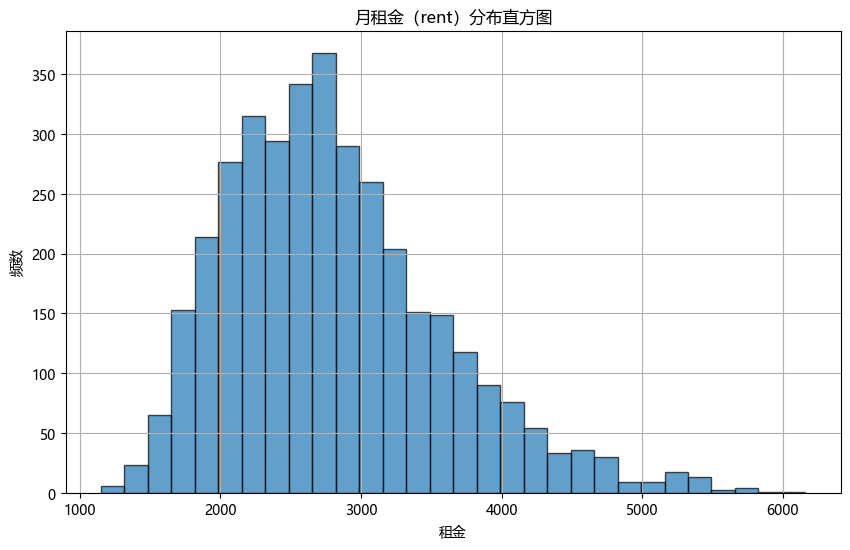
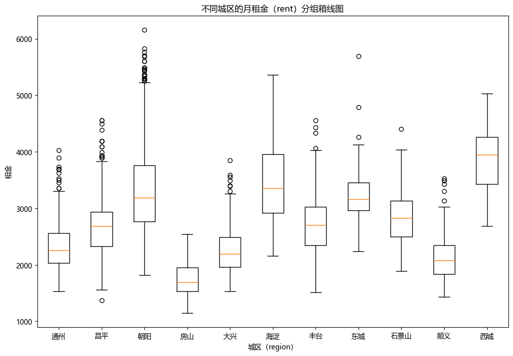
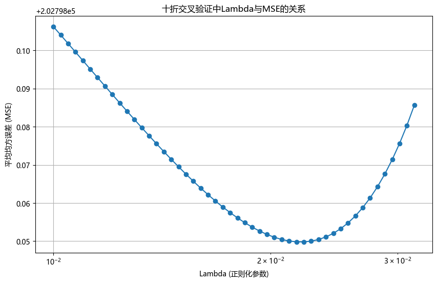

```python
import pandas as pd
import numpy as np
import seaborn as sns
from sklearn.model_selection import KFold
import matplotlib.pyplot as plt
plt.rcParams['font.family'] = 'Microsoft YaHei'
plt.rcParams['axes.unicode_minus'] = False
```


```python
train_data = pd.read_csv("train_data.csv")
test_data = pd.read_csv("test_data.csv")
```


```python
train_data.head()
```


<div>
<style scoped>
    .dataframe tbody tr th:only-of-type {
        vertical-align: middle;
    }

    .dataframe tbody tr th {
        vertical-align: top;
    }

    .dataframe thead th {
        text-align: right;
    }
</style>
<table border="1" class="dataframe">
  <thead>
    <tr style="text-align: right;">
      <th></th>
      <th>rent</th>
      <th>bedroom</th>
      <th>livingroom</th>
      <th>bathroom</th>
      <th>area</th>
      <th>room</th>
      <th>floor_grp</th>
      <th>subway</th>
      <th>region</th>
      <th>heating</th>
    </tr>
  </thead>
  <tbody>
    <tr>
      <th>0</th>
      <td>2330</td>
      <td>3</td>
      <td>1</td>
      <td>1</td>
      <td>15</td>
      <td>主卧</td>
      <td>低楼层</td>
      <td>是</td>
      <td>通州</td>
      <td>集中供暖</td>
    </tr>
    <tr>
      <th>1</th>
      <td>2860</td>
      <td>3</td>
      <td>1</td>
      <td>1</td>
      <td>15</td>
      <td>主卧</td>
      <td>中楼层</td>
      <td>是</td>
      <td>昌平</td>
      <td>集中供暖</td>
    </tr>
    <tr>
      <th>2</th>
      <td>2430</td>
      <td>3</td>
      <td>1</td>
      <td>1</td>
      <td>14</td>
      <td>主卧</td>
      <td>中楼层</td>
      <td>是</td>
      <td>朝阳</td>
      <td>自采暖</td>
    </tr>
    <tr>
      <th>3</th>
      <td>1830</td>
      <td>3</td>
      <td>1</td>
      <td>1</td>
      <td>10</td>
      <td>次卧</td>
      <td>低楼层</td>
      <td>是</td>
      <td>房山</td>
      <td>自采暖</td>
    </tr>
    <tr>
      <th>4</th>
      <td>2710</td>
      <td>2</td>
      <td>1</td>
      <td>1</td>
      <td>10</td>
      <td>次卧</td>
      <td>低楼层</td>
      <td>是</td>
      <td>朝阳</td>
      <td>集中供暖</td>
    </tr>
  </tbody>
</table>
</div>


```python
test_data.head()
```


<div>
<style scoped>
    .dataframe tbody tr th:only-of-type {
        vertical-align: middle;
    }

    .dataframe tbody tr th {
        vertical-align: top;
    }

    .dataframe thead th {
        text-align: right;
    }
</style>
<table border="1" class="dataframe">
  <thead>
    <tr style="text-align: right;">
      <th></th>
      <th>rent</th>
      <th>bedroom</th>
      <th>livingroom</th>
      <th>bathroom</th>
      <th>area</th>
      <th>room</th>
      <th>floor_grp</th>
      <th>subway</th>
      <th>region</th>
      <th>heating</th>
    </tr>
  </thead>
  <tbody>
    <tr>
      <th>0</th>
      <td>2730</td>
      <td>2</td>
      <td>1</td>
      <td>1</td>
      <td>12</td>
      <td>主卧</td>
      <td>高楼层</td>
      <td>是</td>
      <td>通州</td>
      <td>集中供暖</td>
    </tr>
    <tr>
      <th>1</th>
      <td>2650</td>
      <td>4</td>
      <td>1</td>
      <td>1</td>
      <td>8</td>
      <td>次卧</td>
      <td>低楼层</td>
      <td>是</td>
      <td>丰台</td>
      <td>集中供暖</td>
    </tr>
    <tr>
      <th>2</th>
      <td>2000</td>
      <td>2</td>
      <td>1</td>
      <td>1</td>
      <td>10</td>
      <td>次卧</td>
      <td>高楼层</td>
      <td>是</td>
      <td>大兴</td>
      <td>集中供暖</td>
    </tr>
    <tr>
      <th>3</th>
      <td>2780</td>
      <td>4</td>
      <td>1</td>
      <td>1</td>
      <td>13</td>
      <td>主卧</td>
      <td>中楼层</td>
      <td>是</td>
      <td>朝阳</td>
      <td>集中供暖</td>
    </tr>
    <tr>
      <th>4</th>
      <td>2790</td>
      <td>4</td>
      <td>1</td>
      <td>1</td>
      <td>10</td>
      <td>次卧</td>
      <td>低楼层</td>
      <td>是</td>
      <td>昌平</td>
      <td>集中供暖</td>
    </tr>
  </tbody>
</table>
</div>


```python
train_data.describe()
```


<div>
<style scoped>
    .dataframe tbody tr th:only-of-type {
        vertical-align: middle;
    }

    .dataframe tbody tr th {
        vertical-align: top;
    }

    .dataframe thead th {
        text-align: right;
    }
</style>
<table border="1" class="dataframe">
  <thead>
    <tr style="text-align: right;">
      <th></th>
      <th>rent</th>
      <th>bedroom</th>
      <th>livingroom</th>
      <th>bathroom</th>
      <th>area</th>
    </tr>
  </thead>
  <tbody>
    <tr>
      <th>count</th>
      <td>3604.000000</td>
      <td>3604.000000</td>
      <td>3604.000000</td>
      <td>3604.000000</td>
      <td>3604.000000</td>
    </tr>
    <tr>
      <th>mean</th>
      <td>2798.343507</td>
      <td>2.995838</td>
      <td>1.009434</td>
      <td>1.024972</td>
      <td>12.853219</td>
    </tr>
    <tr>
      <th>std</th>
      <td>766.521027</td>
      <td>0.799482</td>
      <td>0.096683</td>
      <td>0.156062</td>
      <td>4.165643</td>
    </tr>
    <tr>
      <th>min</th>
      <td>1150.000000</td>
      <td>2.000000</td>
      <td>1.000000</td>
      <td>1.000000</td>
      <td>5.000000</td>
    </tr>
    <tr>
      <th>25%</th>
      <td>2230.000000</td>
      <td>2.000000</td>
      <td>1.000000</td>
      <td>1.000000</td>
      <td>10.000000</td>
    </tr>
    <tr>
      <th>50%</th>
      <td>2690.000000</td>
      <td>3.000000</td>
      <td>1.000000</td>
      <td>1.000000</td>
      <td>12.000000</td>
    </tr>
    <tr>
      <th>75%</th>
      <td>3222.500000</td>
      <td>4.000000</td>
      <td>1.000000</td>
      <td>1.000000</td>
      <td>15.000000</td>
    </tr>
    <tr>
      <th>max</th>
      <td>6160.000000</td>
      <td>5.000000</td>
      <td>2.000000</td>
      <td>2.000000</td>
      <td>30.000000</td>
    </tr>
  </tbody>
</table>
</div>


```python
test_data.describe()
```


<div>
<style scoped>
    .dataframe tbody tr th:only-of-type {
        vertical-align: middle;
    }

    .dataframe tbody tr th {
        vertical-align: top;
    }

    .dataframe thead th {
        text-align: right;
    }
</style>
<table border="1" class="dataframe">
  <thead>
    <tr style="text-align: right;">
      <th></th>
      <th>rent</th>
      <th>bedroom</th>
      <th>livingroom</th>
      <th>bathroom</th>
      <th>area</th>
    </tr>
  </thead>
  <tbody>
    <tr>
      <th>count</th>
      <td>1545.00000</td>
      <td>1545.000000</td>
      <td>1545.000000</td>
      <td>1545.000000</td>
      <td>1545.000000</td>
    </tr>
    <tr>
      <th>mean</th>
      <td>2795.63754</td>
      <td>2.995469</td>
      <td>1.009709</td>
      <td>1.030421</td>
      <td>12.847249</td>
    </tr>
    <tr>
      <th>std</th>
      <td>752.99256</td>
      <td>0.798707</td>
      <td>0.098085</td>
      <td>0.171798</td>
      <td>4.177874</td>
    </tr>
    <tr>
      <th>min</th>
      <td>1190.00000</td>
      <td>2.000000</td>
      <td>1.000000</td>
      <td>1.000000</td>
      <td>5.000000</td>
    </tr>
    <tr>
      <th>25%</th>
      <td>2260.00000</td>
      <td>2.000000</td>
      <td>1.000000</td>
      <td>1.000000</td>
      <td>10.000000</td>
    </tr>
    <tr>
      <th>50%</th>
      <td>2690.00000</td>
      <td>3.000000</td>
      <td>1.000000</td>
      <td>1.000000</td>
      <td>12.000000</td>
    </tr>
    <tr>
      <th>75%</th>
      <td>3230.00000</td>
      <td>4.000000</td>
      <td>1.000000</td>
      <td>1.000000</td>
      <td>15.000000</td>
    </tr>
    <tr>
      <th>max</th>
      <td>6460.00000</td>
      <td>5.000000</td>
      <td>2.000000</td>
      <td>2.000000</td>
      <td>30.000000</td>
    </tr>
  </tbody>
</table>
</div>


```python
plt.figure(figsize=(10, 6))
plt.hist(train_data['rent'], bins=30, edgecolor='k', alpha=0.7)
plt.title('月租金（rent）分布直方图')
plt.xlabel('租金')
plt.ylabel('频数')
plt.grid(True)
plt.show()
```


    

    


**简要分析**
1. 租金主要分布在 2000-3500 之间, 频数最高的区间大约是 2600 元
2. 直方图呈现右偏趋势, 有少量租金较高的房源


```python
regions = train_data['region'].unique()
rent_by_region = [train_data[train_data['region'] == region]['rent'] for region in regions]
plt.figure(figsize=(12, 8))
plt.boxplot(rent_by_region, tick_labels=regions)
plt.title('不同城区的月租金（rent）分组箱线图')
plt.xlabel('城区（region）')
plt.ylabel('租金')
plt.show()
```


    

    


**简要分析**
1. **朝阳区**：朝阳区的租金中位数较高，四分位距较大，说明租金在不同房源间的差异较大。它有不少高租金的异常值，表明有不少高价房源。
2. **西城区**：西城区的租金中位数较高，与朝阳区相近，但分布范围较为集中。四分位距较小，表明租金差异较小，大部分房源的租金较为一致。
3. **通州区**、**昌平区**、**大兴区**、**房山区**：这些区域的租金相对较低，其中房山区的租金中位数最低。这些区域的四分位距较小，说明这些区域的租金分布较为集中，且价格较为适中。
4. **海淀区**：租金中位数与朝阳、西城相似，但四分位距和异常值更多，显示出海淀区房价的差异化较大，有部分高价房源。
5. **丰台区**：丰台区的租金中位数也比较高，分布较广，显示出房价存在较大差异。
东城区：东城区的租金中位数较高，但四分位距较小，显示大多数房源价格较集中。
6. **石景山区**、**顺义区**：这两个区域的租金较为中等，且四分位距适中，说明租金分布范围较为均匀。


```python
X = train_data.drop(['rent'], axis=1)
X = pd.get_dummies(X, drop_first=True)
X = X.astype(float)
X = X.values
X = np.hstack((np.ones((X.shape[0], 1)), X))
y = train_data['rent'].values.reshape(-1, 1)
```


```python
beta_hat = np.linalg.inv(X.T @ X) @ X.T @ y

print("beta_hat:")
pd.DataFrame(beta_hat)
```

    beta_hat:
    


<div>
<style scoped>
    .dataframe tbody tr th:only-of-type {
        vertical-align: middle;
    }

    .dataframe tbody tr th {
        vertical-align: top;
    }

    .dataframe thead th {
        text-align: right;
    }
</style>
<table border="1" class="dataframe">
  <thead>
    <tr style="text-align: right;">
      <th></th>
      <th>0</th>
    </tr>
  </thead>
  <tbody>
    <tr>
      <th>0</th>
      <td>2196.094140</td>
    </tr>
    <tr>
      <th>1</th>
      <td>-101.752247</td>
    </tr>
    <tr>
      <th>2</th>
      <td>-212.558099</td>
    </tr>
    <tr>
      <th>3</th>
      <td>207.196384</td>
    </tr>
    <tr>
      <th>4</th>
      <td>76.292545</td>
    </tr>
    <tr>
      <th>5</th>
      <td>-17.539118</td>
    </tr>
    <tr>
      <th>6</th>
      <td>47.710990</td>
    </tr>
    <tr>
      <th>7</th>
      <td>44.073344</td>
    </tr>
    <tr>
      <th>8</th>
      <td>279.644619</td>
    </tr>
    <tr>
      <th>9</th>
      <td>-489.364168</td>
    </tr>
    <tr>
      <th>10</th>
      <td>-1013.136101</td>
    </tr>
    <tr>
      <th>11</th>
      <td>-1404.302363</td>
    </tr>
    <tr>
      <th>12</th>
      <td>-540.729931</td>
    </tr>
    <tr>
      <th>13</th>
      <td>40.542216</td>
    </tr>
    <tr>
      <th>14</th>
      <td>301.393741</td>
    </tr>
    <tr>
      <th>15</th>
      <td>-598.224581</td>
    </tr>
    <tr>
      <th>16</th>
      <td>404.887726</td>
    </tr>
    <tr>
      <th>17</th>
      <td>-979.756357</td>
    </tr>
    <tr>
      <th>18</th>
      <td>-1026.958408</td>
    </tr>
    <tr>
      <th>19</th>
      <td>161.763808</td>
    </tr>
  </tbody>
</table>
</div>


```python
y_pred = X @ beta_hat
residuals = y - y_pred
MSE = np.mean(residuals**2)
print(f"MSE = {MSE}")
```

    MSE = 200419.47721842467
    


```python
def ridge_regression(X, y, lambda_reg):
    p = X.shape[1]
    I = np.eye(p)
    XtX = X.T @ X
    XtX_plus_lambdaI = XtX + lambda_reg * I
    XtX_plus_lambdaI_inv = np.linalg.inv(XtX_plus_lambdaI)
    beta_ridge = XtX_plus_lambdaI_inv @ X.T @ y
    return beta_ridge
```


```python
def cross_validate_ridge(X, y, lambdas, k=10):
    kf = KFold(n_splits=k, shuffle=True, random_state=42)
    mse_lambdas = []
    
    for lambda_reg in lambdas:
        mse_folds = []
        for train_index, val_index in kf.split(X):
            X_train, X_val = X[train_index], X[val_index]
            y_train, y_val = y[train_index], y[val_index]

            beta_ridge = ridge_regression(X_train, y_train, lambda_reg)
            
            y_val_pred = X_val @ beta_ridge
            
            mse = np.mean((y_val - y_val_pred) ** 2)
            mse_folds.append(mse)
        
        mse_avg = np.mean(mse_folds)
        mse_lambdas.append(mse_avg)
    
    return mse_lambdas
```


```python
lambdas = np.logspace(-2, -1.5, 50)

mse_lambdas = cross_validate_ridge(X, y, lambdas, k=10)

optimal_lambda = lambdas[np.argmin(mse_lambdas)]
print(f"最优的 lambda 值: {optimal_lambda}")
```

    最优的 lambda 值: 0.022229964825261943
    


```python
plt.figure(figsize=(10, 6))
plt.plot(lambdas, mse_lambdas, marker='o')
plt.xscale('log')
plt.xlabel('Lambda (正则化参数)')
plt.ylabel('平均均方误差 (MSE)')
plt.title('十折交叉验证中Lambda与MSE的关系')
plt.grid(True)
plt.show()
```


    

    


```python
beta_final = ridge_regression(X, y, optimal_lambda)
print("最终模型的回归系数 (beta_final):")
pd.DataFrame(beta_final)
```

    最终模型的回归系数 (beta_final):
    


<div>
<style scoped>
    .dataframe tbody tr th:only-of-type {
        vertical-align: middle;
    }

    .dataframe tbody tr th {
        vertical-align: top;
    }

    .dataframe thead th {
        text-align: right;
    }
</style>
<table border="1" class="dataframe">
  <thead>
    <tr style="text-align: right;">
      <th></th>
      <th>0</th>
    </tr>
  </thead>
  <tbody>
    <tr>
      <th>0</th>
      <td>2191.337635</td>
    </tr>
    <tr>
      <th>1</th>
      <td>-101.710584</td>
    </tr>
    <tr>
      <th>2</th>
      <td>-210.943029</td>
    </tr>
    <tr>
      <th>3</th>
      <td>207.232679</td>
    </tr>
    <tr>
      <th>4</th>
      <td>76.310027</td>
    </tr>
    <tr>
      <th>5</th>
      <td>-17.425862</td>
    </tr>
    <tr>
      <th>6</th>
      <td>47.758053</td>
    </tr>
    <tr>
      <th>7</th>
      <td>44.083271</td>
    </tr>
    <tr>
      <th>8</th>
      <td>279.763191</td>
    </tr>
    <tr>
      <th>9</th>
      <td>-486.853361</td>
    </tr>
    <tr>
      <th>10</th>
      <td>-1010.574262</td>
    </tr>
    <tr>
      <th>11</th>
      <td>-1401.562230</td>
    </tr>
    <tr>
      <th>12</th>
      <td>-538.234581</td>
    </tr>
    <tr>
      <th>13</th>
      <td>42.991126</td>
    </tr>
    <tr>
      <th>14</th>
      <td>303.861154</td>
    </tr>
    <tr>
      <th>15</th>
      <td>-595.669560</td>
    </tr>
    <tr>
      <th>16</th>
      <td>407.218739</td>
    </tr>
    <tr>
      <th>17</th>
      <td>-977.225152</td>
    </tr>
    <tr>
      <th>18</th>
      <td>-1024.446795</td>
    </tr>
    <tr>
      <th>19</th>
      <td>161.872422</td>
    </tr>
  </tbody>
</table>
</div>


```python
X_test = test_data.drop(['rent'], axis=1)
X_test = pd.get_dummies(X_test, drop_first=True)
X_test = X_test.astype(float)
X_test = X_test.values
X_test = np.hstack((np.ones((X_test.shape[0], 1)), X_test))
y_test = test_data['rent'].values.reshape(-1, 1)

y_test_pred = X_test @ beta_final

MSE_test = np.mean((y_test - y_test_pred) ** 2)
print(f"测试集上的均方误差 (MSE): {MSE_test:.2f}")
```

    测试集上的均方误差 (MSE): 218396.74
    
